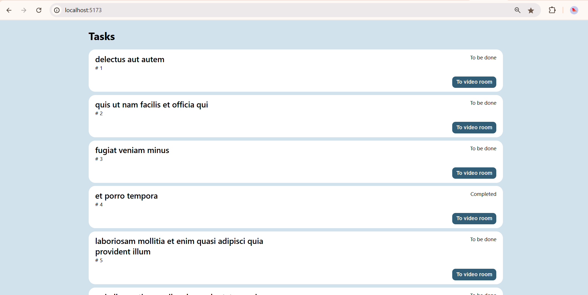
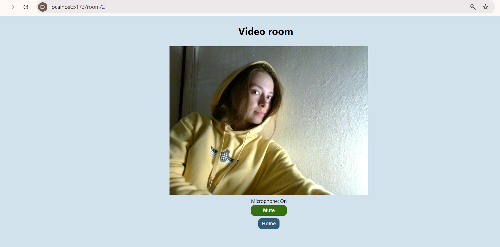

# React WebRTC

## Task

Two pages: todo list and video room (WebRTC).

  
  

## Stack

- React 18, Vite, TypeScript
- React Router
- WebRTC (getUserMedia)

## Setup

```bash
npm i
npm run dev
```
